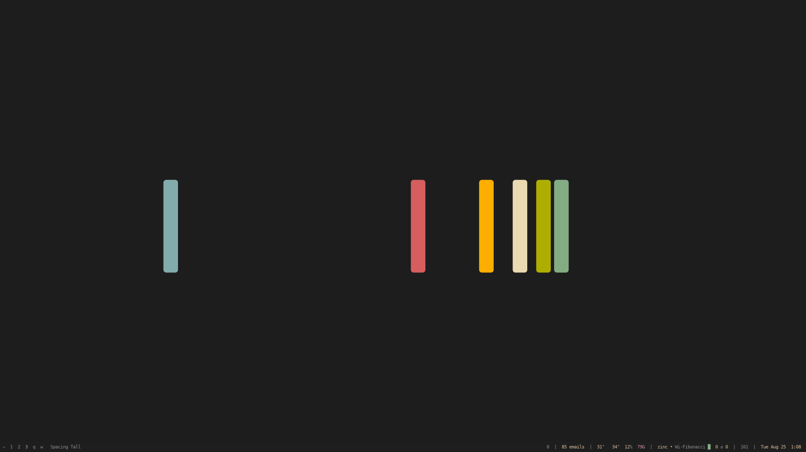

Ricing out your Linux desktop is a [rite of passage](https://www.youtube.com/watch?v=qiQlZU5oWTQ).

First you try a [distro](https://distrowatch.com/table.php?distribution=void) that fits you, you get your workflow happy, etc.

[*Then you trick it out*](https://www.reddit.com/r/unixporn/).

## Base

- **Void Linux**
  - Let's use [`runit`](https://github.com/g-pape/runit/pull/51). Systemd is not UNIX ([it sucks](https://suckless.org/sucks/systemd/)).
  - Rolling release. No major version upgrades.
  - Easy to learn and love.
- **Xmonad**
  - Turing complete config written in [Haskell](https://www.haskell.org/), one of the coolest languages of all time.
  - In the age of LLMs few could convince me not to use a code-as-config window manager.
- **Alacritty**
  - KISS term. GPU accelerated. Let my WM do the tabs and panes.
  - Also got Kitty, which does [sixel](https://www.arewesixelyet.com/).

## Gruvbox

Want to feel the warm embrace of a 70s retro-futurism masterpiece? Try you a Gruvbox. This entire site is themed to look and feel like my Linux experience.




## Multiple workspaces

With Xmonad, you get a real "mod" key and anything can be a workspace.

```haskell
myWorkspaces = [
  " ~", " 1", " 2", " 3", " 4", " 5", " 6", " 7", " 8", " 9", " 0"
  , " q", " w", " e", " a", " s"
  , " ⇥", " ⇧"
  ]
```

For example, `w` is for social interactions (weechat, signal, mutt, etc), `q` is for web browsing, `1` is for my main thing, `2` is for my other thing, `~` is my dotfiles or meta work, etc.
